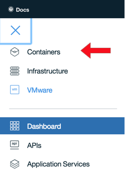
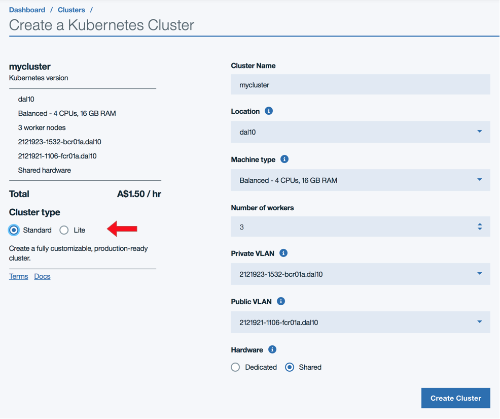
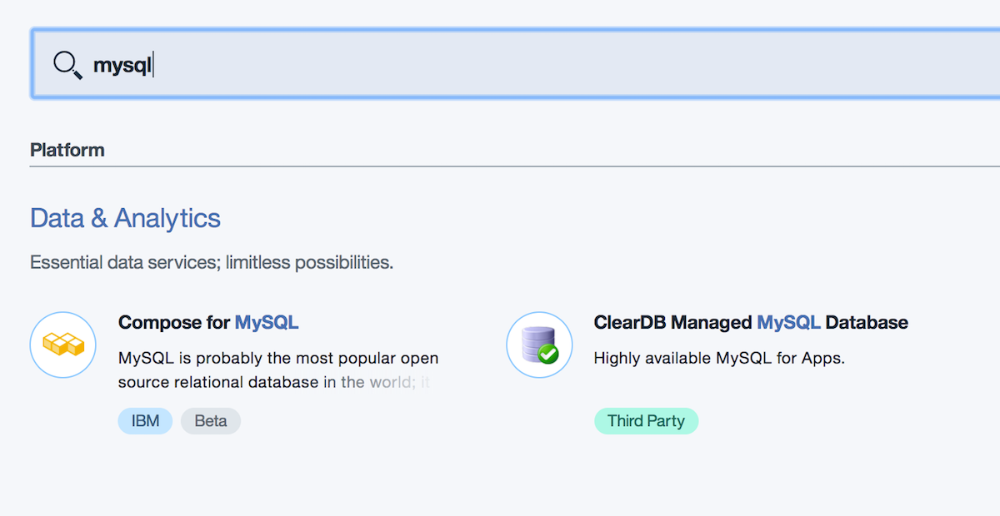
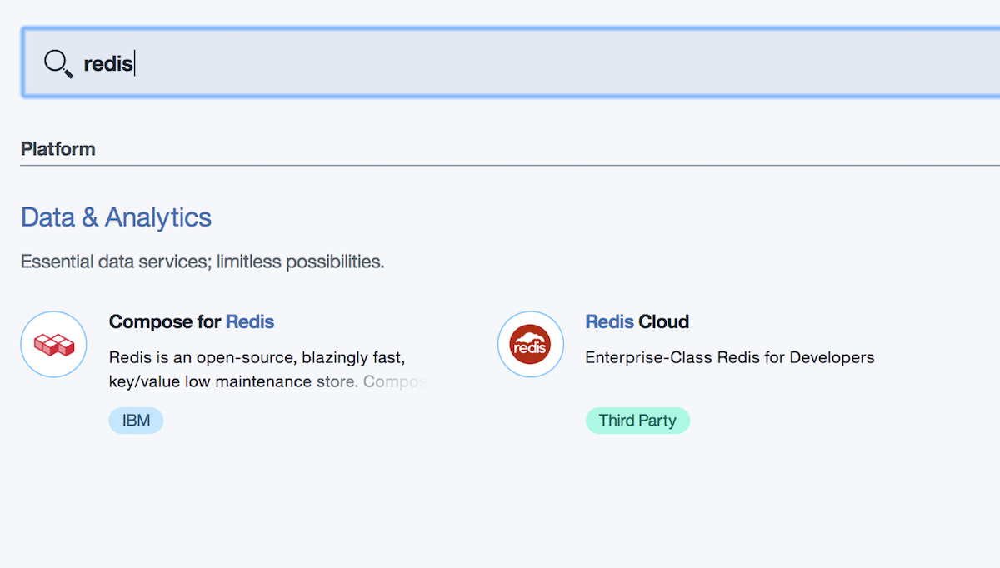
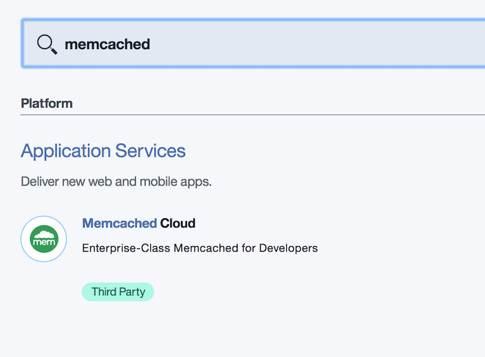

## Provision a Kubernetes cluster on the IBM Bluemix Container Service
- Create a paid Bluemix account, and log into the Bluemix dashboard.
- Choose Containers from the left hand hamburger navigation.

    

- Click the Create cluster button.

    

- Select the Standard type of cluster (this allows for storage volumes) and Create.

    

- Going back to the Dashboard from the navigation, you'll see your cluster.

- Click on it to see the cluster Overview.

    

- Click on Worker Nodes to get details on your worker nodes.

    

- It will take time for the cluster to complete provisioning, so go get some coffee.

## Connect to your Kubernetes cluster from your workstation
- Click on the Access link to download and configure the `bx` and `kubectl` CLIs. Kubectl version >=1.7.6 is required.

    

- Run the configuration commands, making sure that the `$KUBECONFIG` variable path is indeed correct (it may not reflect your actual home directory).
- You can then use `kubectl` or the `kubectl proxy` dashboard web UI that starts on localhost to inspect your Kubernetes environment.

## Provision and bind a MySQL-as-a-Service
- You can do this with the `bx` command too, but I prefer to work with the dashboard as it's a one time setup operation with several options.
- Go to the hamburger navigation again and choose Data & Analytics.

    

- Click "Create"

    

- You have a choice of two MySQL-as-a-Service providers, Compose and ClearDB. Compose is the preferred option, but ClearDB is quicker to get running with for a PoC.

    

- Take note of the credentials, and save them in a `scripts/kubernetes/secrets/service-credentials.txt` file you copy from [`scripts/kubernetes/secrets/service-credentials.txt.tpl`](../scripts/kubernetes/secrets/service-credentials.txt.tpl).
- The Bluemix Container Service offers a way to autobind credentials, but using a secret from this credentials file gives us the option to use services in another organization and space and/or start it up later as its own pod.

## Provision and bind a Redis-as-a-Service
- You can do this with the `bx` command too, but I prefer to work with the dashboard as it's a one time setup operation with several options.
- Go to the hamburger navigation again and choose Data & Analytics.

    

- Click "Create"

    

- You have a choice of two Redis-as-a-Service providers, Compose and Redis Cloud. Compose is the preferred option, but Redis Cloud has more plan options.
- Take note of the credentials, and save them in `scripts/kubernetes/secrets/service-credentials.txt`.

    

## Provision and bind a Memcached-as-a-Service
- You can do this with the `bx` command too, but I prefer to work with the dashboard as it's a one time setup operation with several options.
- Go to the hamburger navigation again and choose Data & Analytics.

    

- Click "Create"

    

- Choose Memcached from Redis Cloud.

    

- Take note of the credentials, and save them in `scripts/kubernetes/secrets/service-credentials.txt`.
